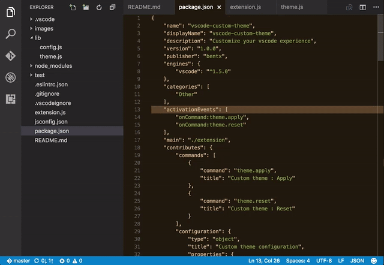

# Custom theme for Visual Studio Code

Customize your [Visual Studio Code](https://code.visualstudio.com/) experience, use your own colors.



## Installation
Type `cmd-shift-p` to launch command palette and choose `Extensions: Install Extension`. Search this package and install.

### On Windows
You will need to run Visual Studio Code as Administrator before you apply your theme, after that you can re-open it with normal privileges.

### On Linux
A permission tweak is needed, you'll need to run this in your terminal :
```sh
sudo chown -R $(whoami) /usr/share/code
```

## Usage
Type `cmd-shift-p` to launch command palette and choose one of these commands :

- `Custom theme : Apply`. It will apply the current theme as defined in your settings, check the `Extension Settings` section for more details.
- `Custom theme : Reset`. It will reset to the original Visual Studio Code theme.

## Extension Settings

This extension contributes the following settings:

* `theme.dark.activitybar.background.color`: The activity bar background color (dark theme).
* `theme.light.activitybar.background.color`: The activity bar background color (light theme).
* `theme.dark.filetree.background.color`: The file tree background color (dark theme).
* `theme.light.filetree.background.color`: The file tree background color (light theme).
* `theme.dark.tabs.background.color`: The tabs background color (dark theme).
* `theme.light.tabs.background.color`: The tabs background color (light theme).
* `theme.dark.tabs.border.color`: The tabs border color (dark theme).
* `theme.light.tabs.border.color`: The tabs border color (light theme).
* `theme.dark.tabs.toolbox.background.color`: The tabs toolbox background color (top right bar, dark theme).
* `theme.light.tabs.toolbox.background.color`: The tabs toolbox background color (top right bar, light theme).
* `theme.statusbar.background.color`: The status bar background color.
* `theme.statusbar.backgroundRaw.color`: The status bar background color (no project).
* `theme.statusbar.backgroundDebug.color`: The status bar background color (debug mode).
* `theme.statusbar.text.color`: The status bar text color.
* `theme.statusbar.smiley.enabled`: Display or hide the status bar smiley face.

## Release Notes

### 1.0.0

Initial release
